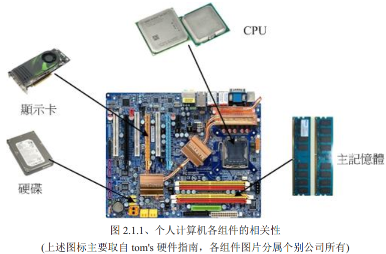
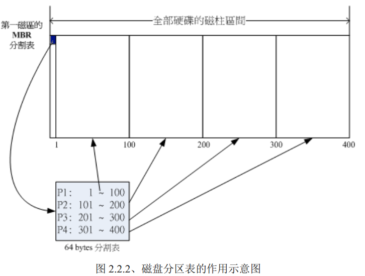
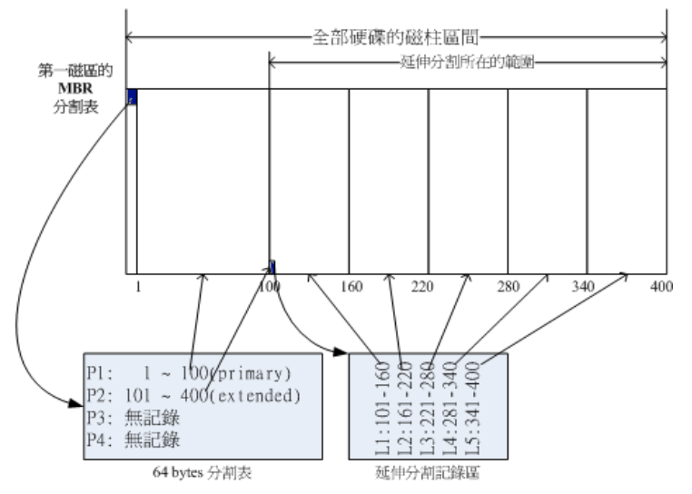
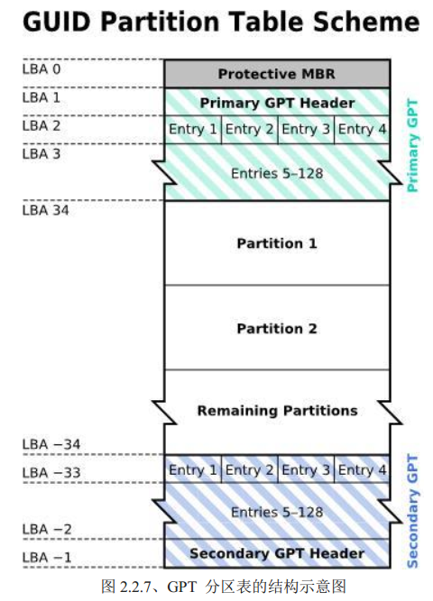
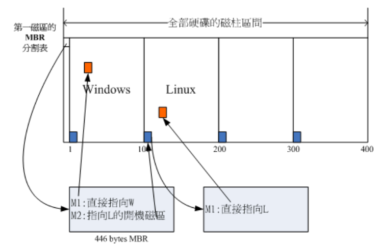
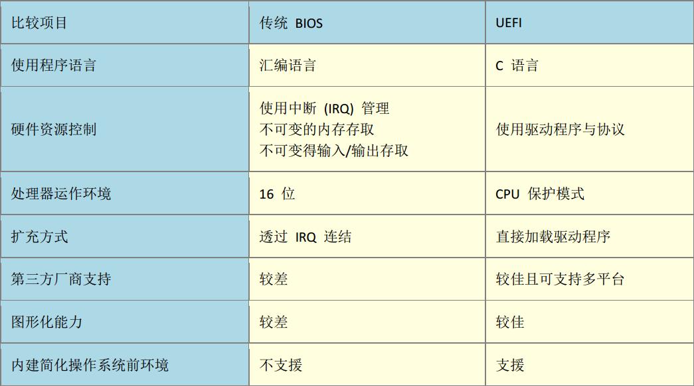
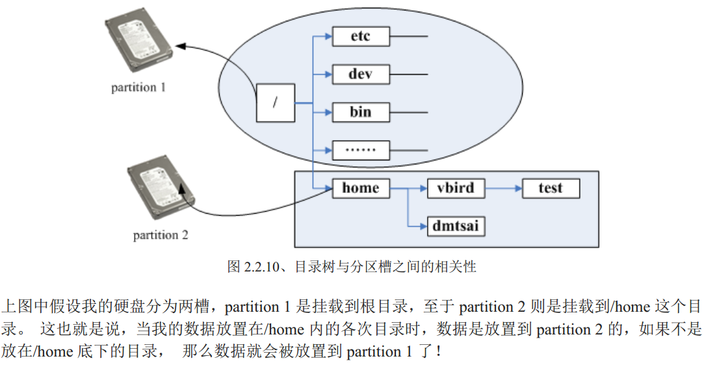

[TOC]

# 主机规划

> *  事实上 要安装好一部Linux主机并不是很简单  必须针对于distributionS的特性、服务器软件的能力、未来的升级需求等等来考虑
还得要知道磁盘分区、文件系统、Linux操作较频繁的目录都必须有一定的了解

## Linux 与硬件的配置
> * 虽然个人计算机各个组件的主要接口是大同小异，包括前面的种种接口，但是由于新的技术来得太快，Linux核心针对于新硬件所纳入的驱动程序模块比不过硬件更新速度，加上硬件厂商针对Linux所推出的驱动程序较慢  所以最好选择已经安装过Linux的比较好
> * 安装之前 最好了解Linux预计是想要达成什么任务，这样选购硬件会知道那个组件最重要。举例来说 桌面计算机（Desktop）的用户，应该用到X Window系统（显示适配器与内存的大小就很重要）
> * 如果做成文件服务器 ,那么硬盘或者其他存储设备 ,就最重要
> * Linux之下，各个组件就是一个文件

## 认识计算机的硬件配备
* 这里主要介绍较为普遍的个人计算机架构来设定Linux服务器



### 游戏机/工作机的考虑
> * 事实上 计算机主机的硬件配备与这部主机未来的功能是有很大关系的. 
举例来说 ,游戏机的配备一定比工作机配置更加高档 ,因为现在一般的三维计算机游戏所需要的3D光影运算太多了,所以显示适配器与CPU资源都会被耗用的非常多,当然就需要比较高级的配置,尤其是显示适配器 ,CPU 以及主板芯片组的功能.

### 效能/价格比 & 效能/消耗瓦数比
> * 并不是贵好   在电费高居不下之下   如何兼顾省钱与能效问题很重要
> * 一般刚出炉的硬件都非常贵，而操作系统不一定能支持， 所以主流级产品比较好   我们最好考虑效能/价格比。
> * 电费越来越高 ，如何省电也很重要 ，硬件评论界有所谓的每瓦效能比

### 支持度的考虑
并非所有的产品都会支持特定的操作系统  设计硬件开发商是否有意开发驱动程序 因此当我们升级某些组件时  必须注意该硬件是否有针对您的操作系统提供适当的驱动程序

## 选择与Linux搭配的主机配备
> * 过于早期的硬件已经没有能力担负新的Linux distribution. 而且较早期的硬件配备 也可能由于保存的问题或者是电子零件老化的问题，导致这样的计算机系统反而容易在运作过程中出现不明的宕机情况
> * 不过由于Linux运作不需要硬件配备过于高档，所以近期（几年内）的计算机都十分OK，CPU为i3等级以上都不算太老旧，说不定能够作为生活中的Linux服务器，或备用服务器
> * 但是如果你的Linux主机要是作为企业内部的Mail server或者Proxy server时，或需要使用图形接口的运算(X Window内的 OpenGL) 就必须使用高档点的计算机了
> * VGA   对于不需要X Window的服务器，显示适配器算是最不重要的一个组件了，但如果需要X window系统，显示适配器最好拥有32MB 以上的内存。
> * Network Interface Card
最重要的部件，目前主板大多内建10/100/1000Mbps的超高速以太网络卡。
> * 光盘、软盘、键盘与鼠标
（非必须组件）

## 各装置在Linux中的文件名
* 再次强调[在 Linux系统中，每个装置都被当成一个文件来对待]
* 另外，在Linux系统中，几乎所有的硬件装置文件都在/dev这个目录下面
* linux常见的装置名
    |装置| 装置在Linux内的文件名|
    |:---|:---:|
    |SCSI/SATA/USB硬盘机|/dev/sd[a-p]|
    |Virtl/O界面|/dev/vd[a-p]|
    |软盘驱动器|/dev/fd[0-7]|
    |打印机|/dev/lp[0-2] (25针打印机)<br/>/dev/usb/lp[0-15] \(usb界面)|
    |鼠标|/dev/input/mouse[0-15]\(通用)<br />/dev/psaux (PS/2界面)<br/>/dev/mouse (当前鼠标)|
    |CDROM/DVDROM|/dev/scd[0-1] \(通用)<br/> /dev/sr[0-1] \(通用)<br/>/dev/cdrom (当前rom)|
* 由于ide界面的磁盘驱动器已经被淘汰，所以ide界面的磁盘文件名也都被仿真为了 /dev/sd[a-p] ,此外如果使用和因特网提供商(ISP) 申请的云端机器，那么磁盘文件名为/dev/vd[a-p]

# 磁盘分区

***Linux总归是要安装到磁盘上的，那么一块磁盘是可以被分区成多个分区槽的，例如 Windows上的观点，你可能会将一颗磁盘分区成C: , D: , E:槽。 但是Linux的装置都是以文件的形态存在的，那么分区槽的档名又是什么？如何进行磁盘分区？磁盘分区的限制有哪些？目前的BIOS与UEFI分别是什么？MSDOS与GPT又是啥***

## 磁盘连接的方式与装置文件名的关系
* 我们知道个人计算机常见的磁盘接口有两种，分别是SATA与SAS接口 在Linux中一般都为/dev/sd[a-p]. 而对于虚拟机来说，这些机器可能使用的不是正规的磁盘，**正常的实体机器大概都使用的/dev/sd[a-p]的磁盘文件名，而虚拟环境下，可能会使用/dev/vd[a-p]**

* 以SATA接口来说，由于SATA/USB/SAS等磁盘接口都是使用SCSI模块驱动的，因此这些接口的磁盘装置文件名都是`/dev/sd[a-p]` 所以SATA/USB接口的磁盘根本就没有一定的顺序， *这个时候要根据linux核心侦测到磁盘的顺序*
    > * 例题：
    > 如果你的pc上面有两个SATA磁盘已经一个usb磁盘，而主板上有6个SATA插槽。这两个磁盘分别安插在主板SATA1,SATA5, 那么三个磁盘的文件名为？
    >>  * SATA1 插槽上的档名  /dev/sda
    >> *  SATA2插槽上的档名  /dev/sdb
    >> usb磁盘（开机之后才被系统捉到） /dev/sdc

* 那么每一个磁盘都可能会分区成多个分区槽，那么每个分区槽的装置文件名又是什么？
    > * 磁盘的组成
    >> * 磁盘的组成主要有磁盘盘、机械手臂、磁盘读取头与主轴马达所组成的，数据的写入是写入到磁盘盘上面的
    >> * 磁盘盘上面又可以细分出扇区（Sector）与磁道(Track)两种单位，其中扇区的物理量设计有两种大小，分别是512bytes与4Kbytes.
    >>> * 其实整个磁盘的第一个扇区特别重要，因为他记录了整颗磁盘的重要信息！<br /> 
    >>> *  早期磁盘的第一个扇区里面含有的重要信息我们称为MBR（Master Boot Record）格式，但近年磁盘越来越大，造成读写上的困扰，甚至有些大于2TB以上的磁盘分区已经让操作系统无法读取。所以又多了一个新的磁盘分区格式，称之为GPT(GUID partition table) 这两种分区格式与限制不太相同

## MSDOS(MBR)  与 GPT 磁盘分区表(partition table)
但怎么记录磁盘的分割？ <br />
我们看到`开始与结束磁道` ，通常磁盘有多个盘片，所有磁盘盘的同一个磁道我们称为磁柱(Cylinder), 通常为文件系统最小单位，也就是分区槽的最小单位 <br />
但是近来有了GPT这个可以达到64bit记录功能的分区表，我们现在甚至可以使用扇区(sector)号作为分区单位， ***我们就是利用参考对照磁柱或扇区号码的方式来处理***

### MSDOS(MBR) 分区表格式与限制
早期linux系统为了兼容Windows的磁盘，所以使用的是支持Windows的MBR（Master Boot Record）的方式来 ***处理开机管理程序与分区表*** 而开机管理程序纪录区与分区表则通通放在磁盘的第一个扇区， 这个扇区通常为512bytes（旧的都是512bytes）

> * 主要启动纪录区(MBR): 可以安装开机管理程序的地方，有446bytes
> * 分区表(partition table): 记录整颗硬盘分区的状态，有64bytes
> * 55AA  两个字节结尾

***由于分区表所在区块仅有64bytes容量，因此最多仅能有四组纪录区,每组纪录区记录了该区段的起始于结束磁柱号码***


假设上面的硬盘装置文件名为`/dev/sda`时，那么这四个分区槽在Linux系统中的装置文件名会在档名后面加一个数字。
```
p1:    /dev/sda1
p2:    /dev/sda2
p3:    /dev/sda3
p4:    /dev/sda4
```
如上，假设磁盘只有400个磁柱，共分区为301到400号磁柱的范围。
由于mbr分区表只有64bytes而已，最多只能容纳四笔分区记录，这四个分区的记录被称为主要(primary)或者延伸(Extended)分区槽

#### 重要总结
* 其实所谓分区只是针对哪个64bytes的分区表进行设定而已
* 硬盘默认的分区表仅仅能写入四组分区信息
* 这四组分区信息我们称之为主要(primary)或延伸(Extended)分区槽
* 分区槽的最小单位通常为磁柱
* 当系统要写入磁盘时，一定会参考磁盘分区表，才能针对某个某个分区槽进行数据处理

#### 为什么要分区
1. 数据的安全性
分区槽的数据是分开的，所有当需要将某个分区槽的数据重整时（重装系统）可将重要数据移动到其他分区槽，数据更加安全
2. 系统的效能考虑
由于分区槽将数据集中在某一个磁柱范围，有助于数据读取的速度与效能

#### 如何分区四个以上分区
我们可以通过延伸分区的方式来处理，*既然第一个扇区所在的分区表只能记录四组数据，能否利用额外的扇区记录更多分区信息*


* 实际上，延伸分区并不是只占一个，而是会分布在每个扇区最前面几个扇区来记录分区信息的。

* P1 为主要分区，P2则为延伸分区
延伸分区的目的是使用额外的扇区来记录分区信息，延伸分区本身并不能被拿来格式化。

* 如上图右下方那个区块又继续分区出5个分区槽，这5个延伸分区继续切出来的分区槽，就被称为逻辑分区槽(logical partition)

* 如上图右下方那个区块又继续分分区出5个分区槽，这5个有延伸分区继续切出来的分区槽，就被称为 ***逻辑分区槽(logical partition)*** 由于逻辑分区槽是由延伸分区继续分区出来得，所以可以使用的磁柱范围就是延伸分区 所设定的范围

```
    上述分区槽在linux系统中的装置文件名分别为
    P1             /dev/sda1
    p2             /dev/sda2
    L1             /dev/sda5             
    L2             /dev/sda6
    L3             /dev/sda7
    L4             /dev/sda8
    L5             /dev/sda9
```
怎么装置名中没有/dev/sda3  和 /dev/sda4 呢?  因为前面四个号码都给保留给Primary或者Extended用的，所以 ***逻辑分区槽的装置名称好么就由5号开始***   这是mbr分区表中的一个很重要的特性

#### mbr主要特性汇总
* 主要分区与延伸分区最多可以有4笔（硬盘的限制)
* 延伸分区最多只能有一个(操作系统的限制)
* 逻辑分区是由延伸分区持续切割出来的分区槽
* 能够被格式化后，作为数据存取的分区槽为主要分区与逻辑分区，延伸分区无法格式化
* 逻辑分区的数量依据操作系统而不同，linux中的sata磁盘已经可以突破63个以上的分区限制
> * 事实上，分区是个很麻烦的东西，因为他是以 ***磁柱为单位的连续磁盘空间***,且延伸分区又是一个类似独立的磁盘空间，所以在分区的时候得要特别注意
> * 需要特别注意的是，如果两个分区槽都属于逻辑分区或主分区，那么就能够在影响其他分区槽的情况下，将两个分区槽合成一个，但是主分区和逻辑分区的分区槽不能整合在一起，（如果延伸分区被破坏，所有的逻辑分区都将被删除）
> * 第一个扇区所记录的分区表与mbr就是如此重要，所以几乎只要读取磁盘都会先有这个扇区先读起


#### 例题一
* 如果我想将一颗大磁盘，分区成四个partitions，同时还有其他的剩余容量可以让我在未来的时候进行规划，最好如何配置
    > * primary+extended最多只能有四个，Extended最多能有一个，注意：如果使用了四个主分区，即使磁盘还有剩余容量，也无法继续分区，剩余的容量就被浪费了
    > 如果想要把所有四笔记录都花光，那么pppe是比较合适的，所以可以用的四个partitions有3个主分区和一个逻辑分区，剩余容量都在逻辑分区中
    > 如果需要四个以上分区槽，必须要有Extended分区槽， ***因为磁盘连续性，一般建议将Extended的磁柱号码分配在最后面的磁柱内***

#### mbr 分区缺陷
* MBR 分区表除了上述的主分区、延伸分区、逻辑分区需要注意，每组分区表仅有16bytes而已，可记录的信息相当有限！
    > *  操作系统无法抓取到2.2T以上的磁盘容量
    > * MBR仅仅只有一个区块，若被破坏，经常无法或很难救援
    > * mbr内的存放开机管理程序的区块仅仅有446bytes，无法容纳较多程序码

### GUID partition table (GPT磁盘分区表)
* 因为过去的一个山区都是512bytes，不过目前已经有4k的扇区设计出现了，为了兼容所有的磁盘，因此在扇区的定义上面，大多会使用所谓的逻辑区块地址(Logical Block Address,LBA)来处理。GPT将磁盘所有区块以此LBA（预设为512bytes） 第一个LBA称之为LBA0(从0开始编号)
* 与mbr仅仅使用第一个512bytes区块来记录不同，gpt使用了34个LBA区块来记录分区信息，并且除了前面34个LBA 之外，整个磁盘的最后33个LBA也被拿来做一个备份，这样会比较安全



上图详细解释
* LBA0  (MBR相容区块)
    > 与MBR模式是相似的，这个兼容区块也分为两个部分，一个就是和之前446bytes相似的区块， ***存储了第一阶段的开机管理程序***，而原本的分区表的纪录区内，这个兼容模式仅仅放入一个特殊标志的分区，用于标识此磁盘时gpt分区的意思。不懂gpt分区表的磁盘管理程序，就不会认识这颗磁盘，进一步保护磁盘
 * LBA1 (GPT表头记录)
    > 这个部分记录了分区表本身的位置与大小，同时记录了备份用的gpt分区（就是后33个区块）放置的位置，同时放置了分区表的检验机制码(CRC32)操作系统可以根据这个检验码来判断gpt是否正确，如果错误，可以通过这个纪录区来取的备份的GPT（磁盘最后的那个备份区块）来恢复磁盘
 * LBA2-33 (实际记录分区信息处)
    > 从LBA2区块开始，***每个LBA都可以记录4比分区记录，所以默认情况下，总共可以有128笔记录*** 而且每个LBA有512bytes，所以每一笔记录用到128bytes空间，除了每笔记录所需要的标识符与相关的记录之外，gpt在每一笔记录中分别提供了64bit来记录开始/结束的扇区号码，所以gpt分区对于单一分区槽来说最大容量限制就会在  2^64 * 512 = 8 ZB.
 * 现在GPT分区预设可以提供多达128笔记录，而在Linux本身的核心装置记录中，过去针对单一磁盘分区只能到15个，不过核心透过udev等方式的处理，现在已经没有限制，此外gpt分区没有所谓 主，延伸、逻辑分区的概念，都为主分区，每个分区都能格式化使用

* 虽然新版linux大多认识GPT分区表，但是在磁盘管理工具上面，fidsk这个老牌软件并不认识GPT,如果要使用GPT需要使用gdisk或者parted指令才好。
* 另外对于开机管理程序grub第一版并不认识GPT，需要第二版grub2才能够支持使用

## 开机流程中的BIOS与UEFI开机检测程序
* 没有软件的硬件时没有任何作用的，为了计算机硬件资源的合理分配，就有了操作系统软件的产生，由于操作系统会控制所有的硬件并且提供核心功能，因此我们的计算机就能够认识磁盘内的文件系统，并进一步读取硬盘内的软件文件与执行该软件来达成各项软件的执行目的
* 那么既然操作系统也是一个软件，那么计算机又是如何认识这个操作系统软件并且执行他的？开机时没有任何软件系统，那么如何读取硬盘内的操作系统文件？  这就是开机管理程序的作用
* 目前主机系统在加载硬件驱动方面的程序，主要有早期的BIOS与新的UEFI机制

### BIOS搭配MBR/GPT的开机管理流程
* 计算机概论中那个BIOS和CMOS两个东西，CMOS是记录各项硬件参数并且嵌入到主板上面的存储器，BIOS则是一个写入到主板上得一个固件（ ***这个BIOS就是开机的时候，系统会主动执行的第一个程序*** ）
* 接下来，BIOS会去分析计算机中有哪些存储设备，以硬盘为例，BIOS会依据使用者的设定去取得能够开机的硬盘，***并且到该磁盘里面去读取第一个扇区的MBR位置，MBR这个仅仅有446bytes硬盘容量里面会存放最基本的开机管理程序*** ，此时BIOS就功德圆满，之后就是MBR内开机管理程序的任务
* ***这个开机管理程序的目的是加载核心*** ,由于开机管理程序是操作系统在安装的时候所提供的，所以他会认识硬盘内的文件系统，能够读取核心文件，之后就是核心文件的工作，开机管理程序和BIOS公成圆满。之后的工作交给操作系统

#### 开机流程简述
1. BIOS： 开机主动执行的固件，会认识第一个可开机的装置
2. MBR: 第一个可开机装置的第一个扇区内的主要启动纪录区，内含有开机管理程序
3. 开机管理程序(boot loader): 一支可读取核心文件来执行的软件
4. 核心文件： 开始操作系统的功能
* 对于第二点，如果分区表为gpt格式，那么bios也能够从LBA0的mbr兼容区块读取第一阶段的开机管理程序代码，如果开机管理程序能够认识gpt的话，那么使用bios同样可以读取到正确的操作系统核心（但如果开机管理程序不懂得GPT，那么自然无法读取核心文件，开机就失败了）
* 注意，由于LBA0仅仅提供第一阶段的开机管理程序，所以如果使用类似grub的开机管理程序的话，那么就需要额外分区出一个[BIOS boot]分区槽，这个分区槽能够放置其他开机过程所需要的程序代码，通常占用2MB

### Boot loader简述
* BOIS与MBR都是硬件本身会支持的功能，至于Boot loader则是操作系统安装在MBR上面的一套软件，由于MBR仅仅有446bytes，所以非常小，这个boot loader主要的任务有以下这些
    1. 提供选单： 用户可以选择不同的开机项目，也就是多重引导的重要功能
    2. 载入核心文件： 直接指向可开机的程序区段来开始操作系统
    3. 转交给其他的loader： 将开机管理程序转交给其他的loader负责
    > 一台计算机中可能具有两个以上的开机管理程序？ 但磁盘不是只有一个MBR？<br />***开机管理程序除了可以安装在MBR之外，还能够安装在每个分区槽的启动扇区(boot sector)*** 这样才能够实现多重引导
    
    * 图中能够发现，MBR的开机管理程序提供两个选单，
        1. 能够直接加载window的核心文件来开机 
        2. 则能够将开机管理工作交给第二个分区槽的启动扇区(boot sector)
#### 多重引导总结
1. 每个分区槽都拥有自己的启动扇区(boot sector)
2. 图中的系统槽为第一槽及第二槽
3. 实际的可开机核心档案文件是放置到各个分区槽内的
4. loader只会认识自己的系统槽内的可开机核心文件，以及其他loader而已
5. loader可直接指向或者间接将管理权限转交给另一个管理程序

#### 小例题
* 例题：为什么同时安装linux和Windows，最好先安装Windows在安装Linux，这是因为
    1. linux在安装的时候可以选择将开机管理程序安装在MBR或者个别其他的分区槽的启动扇区，并且linux可以手动设定选单，所以可以将linux的boot loader里面加入windows开机选项
    2. windows安装会主动覆盖点MBR以及自己所在分区槽的启动扇区，没有选择的机会
    * 那么如果先安装linux在安装Windows mbr之后有windows项目，不会有linux项目，那么需要重装Linux？ 不需要只要用尽办法处理mbr内容就好，（使用救援模式挽救）

### UEFI BIOS搭配GPT开机的流程
* GPT可以提供到64bit的寻址，也能够使用较大的区块来处理开机管理程序。但是BIOS其实不懂GPT还得要透过GPT提供兼容模式才能够读写这个磁盘装置，而且bios仅仅为16位程序，与现阶段操作系统接轨方面弱爆了，于是有了UEFI（统一可延伸固件界面的产生）
* UEFI就是为了取代BIOS这个固件界面，我们也称UEFI为UEFI BIOS。使用c语言程序，比用汇编的传统BIOS更容易开发（因为使用C语言开发，所以甚至可以在uefi阶段就让系统了解tcp/Ip而直接上网）

* bios与uefi的比较与区别

    * UEFI简直像是一个低阶操作系统，连主板上硬件资源管理都和操作系统类似，只需要驱动就可以控制操作。所以一般UEFI接口的主机，在开机速度逗比BIOS快好多
    * 但UEFI发展的时候，制定了一些控制，包括硬件资源的管理使用轮训（polling）的方式来管理，与BIOS直接了解CPU以中断的方式管理，这种效率要慢一些。UEFI不能提供完整的快取功能，效率没法提升，但加载所有的驱动程序之后，系统会开启一个类似操作系统的shell环境，用户可以执行任意的uefi应用程序
    * 过去黑客经常借由BIOS开机阶段来破坏系统，并取得系统控制权，所以UEFI加入了一个所谓的安全启动（secure boot）机制，代表即将开机的系统必须要被uefi验证，否则无法开机，***但是某些时候，必须关闭secure boot，才能进入linux***
    * 另外，与BIOS模式相比，虽然UEFI可以直接取得GPT分区表，***不过最好直接拥有BIOS boot分区槽*** ，同时为了与window兼容，并提供其他厂商所使用的UEFI应用程序存储空间， ***必须格式化一个vfast文件系统 大于512MB到1G，让其他UEFI执行方便***/

# 磁盘分区的选择
* windows总会考虑C盘容量，D盘容量，Linux中如何规划那？

## 目录树结构（directory tree）
* linux内所有数据都是以文件的形态呈现，所以Linux最重要的就是目录树架构，就是以根目录为主，向下呈现分支状的目录结构的一种文件架构 ***目录树架构最重要的是哪个根目录，表示为/***
* 所有的文件都由根目录衍生，次目录还能有其他文件数据
* 那么如何结合目录树的架构与磁盘内的数据呢？   这就是挂载的问题

### 文件系统与目录树的关系（挂载）
* ***所谓挂载，就是利用一个目录当成进入点，将磁盘分区槽的数据放置到该目录下，就是，进入该目录就可以读取该分区槽的意思***
* 这个动作称为挂载，那个进入点的目录我们称之为挂载点。Linux最重要的为根目录，所以根目录必须挂在到某个分区槽。其他目录依据需求挂载
* 将分区挂在到挂载点上。
    
* 如果想要得知文件在哪个分区可以使用反向追踪法，例如/home/vbird/test,可以test->vbird->home->/   ***看哪个进入点先被查到那就是使用的进入点***
* linux一般将光盘数据挂在到/meida/cmrom中

## distributions安装时，挂载点与磁盘分区规划
* Linux下使用目录树系统，所以必须规划磁盘分区与目录树挂载 ***建议使用 自定义安装Custom***,有的为Expert专家模式
