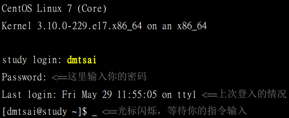

[TOC]

# 首次登入与在线求助

* 由于Linux系统使用了异步的磁盘/内存数据传输模式，又是多人多任务的环境，所以不能随便不正常关机，关机有一定程序，错误关机毁损磁盘数据。

* 什么是图形接口、文字接口？

* 我们能否取得文字接口大量指令，而不必硬背某些选项、参数？

## 首次登入系统

### 首次登入

* 不光能开机，还有登入和离开，由于Linux是多人多任务的环境，所以系统随时都会有很多不同的用户所下达的任务在进行，***所以必须正确开关机*** 不正常开关机会导致文件系统错乱，Linux主机都会加挂不断电系统。

* 一般不要直接使用root登录，系统管理员权限太高，linux下很多指令是没有办法复原的，所以使用一般账号比较安全，

### GNOME的操作与注销

* 询问默认操作环境，依据国际、语言、区域制定与系统默认值不同的环境。

* GNOME 操作界面
    1. 上方任务栏
        * 左侧有应用程序、位置、右侧有输入法切换、声音、网络、日期、账号
        1. 应用程序：所有应用程序
        2. 位置（就是文件管理器）
        3. 中文输入法与设定-> 找到设置-> 地区和语言
    2. 桌面
        * 桌面。。
    3. 下方任务栏
        * 将工作显示在这，方面快速切换各个工作，另外有多个虚拟桌面，可以使用4个

### X Window与文本模式的切换

* 我们通常称文本模式为终端机接口，terminal或console,Linux预设会提供六个Terminal让使用者登陆 [ctrl][alt][f1-f6]

* 在centos7中，开机完成会提供一个tty而已，无论是文字界面还是图形界面都会出现在tty1，只有切换时才会出现tty2-tty6

* 在纯文本界面启动x window
    * startx
    1. 必须没有其他X window被启动
    2. 必须安装了x window system,并能够启动
    3. 最好有窗口管理员，例如GNOME/KDE

* 窗口环境就是 ***文字界面+ X窗口软件*** 文字界面一定存在，窗口界面就是要不要启动而已。

* 其实，所谓的窗口环境，就是[文字界面加上X窗口软件]的组合， 所以文字界面一定会被启动，但是窗口界面软件就看你要不要启动而已。所以我们才有办法在纯文本环境下启动一个个人化的X窗口，所以，是否默认使用图形界面，只要在后续管理服务的程序中，[graphical.target]这个目标服务设置为默认，就能够默认使用图形界面
    从Centos7开始，已经取消了使用多年的SystemV 的服务管理方式，也就是没有了所谓执行等级的概念。新的管理方法使用的是systemd的模式，将很多的服务进行相依管理，以文字与 图形界面为例，就是要不要加入图形软件的服务启动而已，所以不再有/etc/inittab

### 在终端机界面登入linux

* 

    1. CentOS Linux 7(Core) 
    
        显示Linux distribution的名称（CentOS与版本）

    2. Kernel 3.10.0-229.e17.x86_64 on an x86_64 
    
        显示Linux 核心的版本为3.10.0-229.e17.x86, 硬件等级为x86_64

    3. study login:

        那个study是你的主机名，我们在第三章填写主机名为
        
        study.centos.vbird,通常只取一个小数点前的字母，所以就是study 

        至于login:则是一支可以让我们登入的程序。你可以在login:后面输入你的账号

    4. Password:
        要求输入密码，但屏幕上不会显示任何字样

    5. Last login Fri May 29 11:55:05 on tty1
        上次登录系统的时间与终端机名称
    
    6. [dmtsai@study~]\$_;
        这一行则是正确登入之后才显示的讯息，账户名@主机名 
        
        当前目录 $提示字符

        ~符号代表用户的家目录，他是一个变量，root家目录在/
        
        root...
        
        提示字符root提示字符为#
        
        一般用户提示字符为$
    
    7. 图片的第一二行欢迎文字来自于/etc/issue内容
        一般情况下，尽量使用一般账户登录系统
    
    * 离开系统，注销Linux，退出当前账户
        exit

